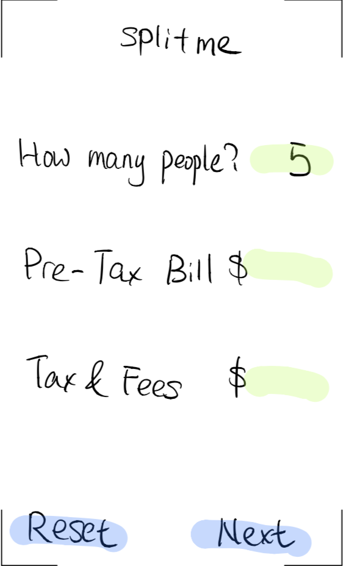
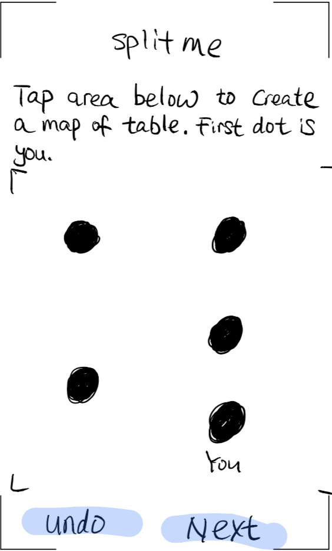
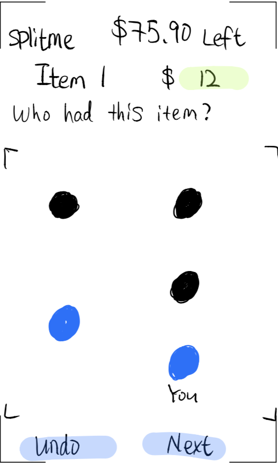
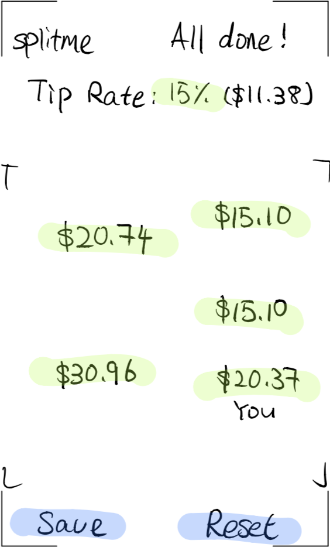
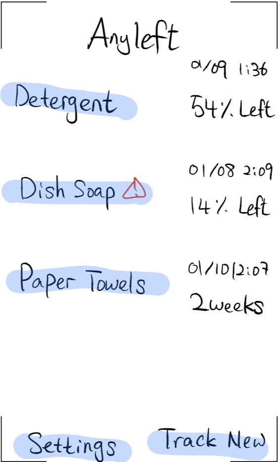
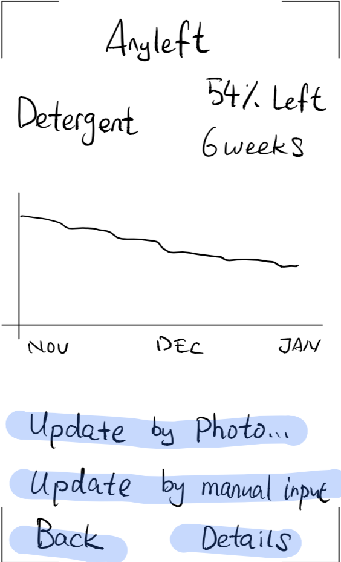
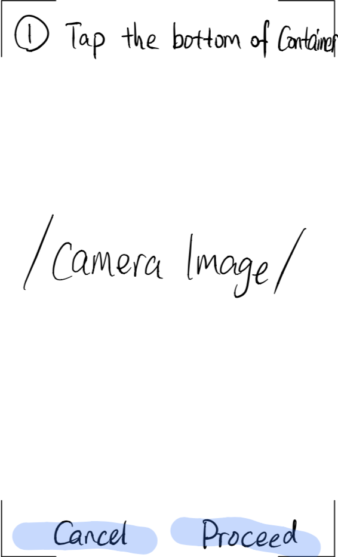
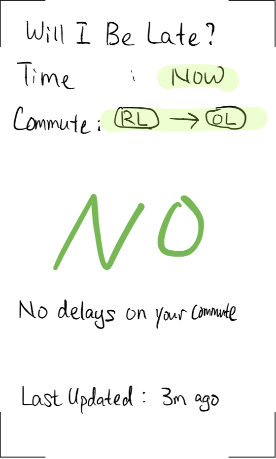
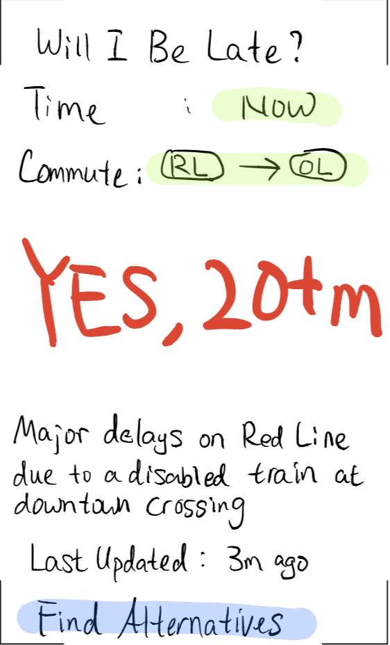
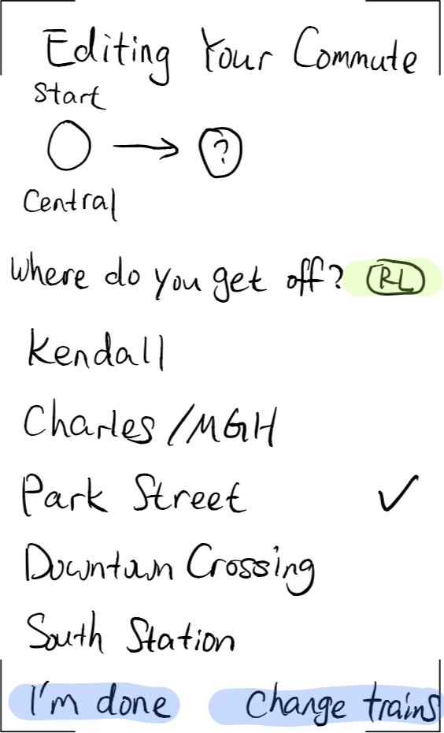

# HCI I1: Project Brainstorming

Nianmin Guo, Due 2019-01-11

## 1: SplitMe -- Bill Splitting App

This mobile application will help the process of splitting a bill among multiple people. Application of similar purposes exist, but this project aims to reduce the confusion during usage. The application will ask for basic information like number of people and bill amount, and will then ask to create a seating map by creating dots on a screen. It will then ask the price for each item and whom it belonged to until the unsettled amount goes to zero. It will finally display the amount each person owes using the created seat map. 

## 2: AnyLeft -- Household Items Tracker

This mobile application is designed to track the usage of household items (e.g., detergent, etc) and to indicate when to get more. When tracking an liquid item, the user can either key in the approximate % left, or the user can take a photo of the container and mark the bottom, top, and liquid level. For each item, a usage plot and a prediction of future usage will be shown, and the app will remind the user by notification if some items is running low or be running low soon.

## 3: Will I be late -- Transit System Tracker

This webpage/mobile application will track the user's commute and display (in large letters) whether there are delays along the commute. The user will be able to add commutes by choosing the routes manually (where to get on, transfer, and get off). When a delay is in place, an estimated delay time and details will be shown while user can see alternative routes. This app will update from the official data source of the transportation agency to ensure the accuracy of data; but a crowdsourcing option can be added in the future. 

