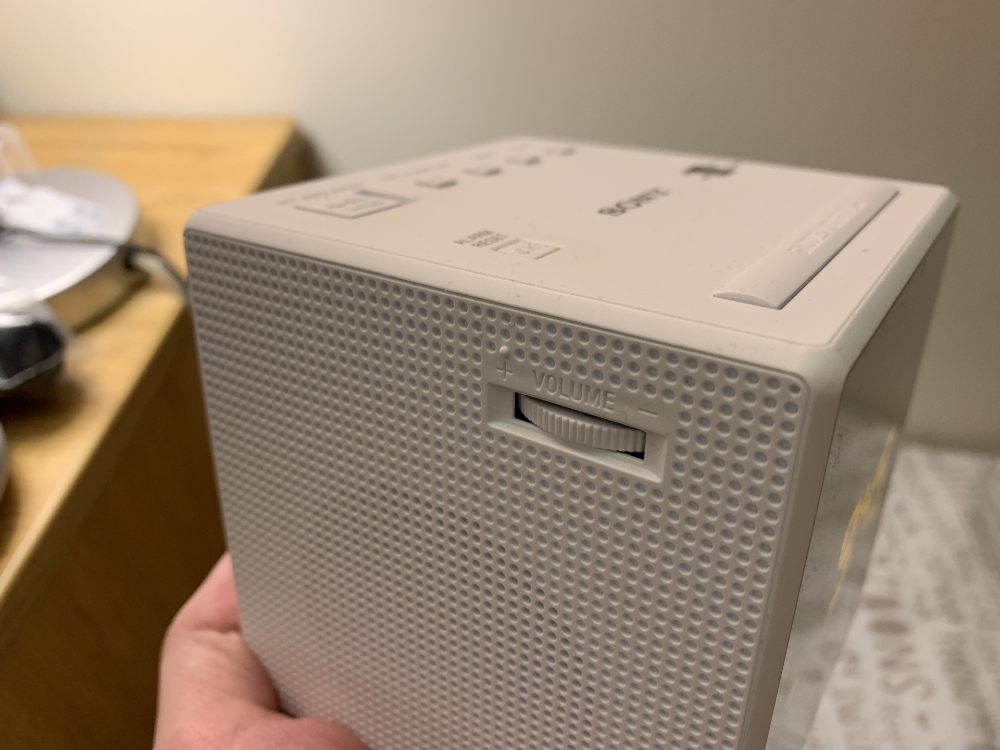

# HCI I2: UI Critique

*This page can also be viewed at [hci.htr.app](https://hci.htr.app/pages/I2-UI_Critique)*

Nianmin Guo, Due 2019-01-22

## The Good

### 1. Sony Clock Radio

The interface of this clock radio enables user to set alarms or current date/time, turn on or tune the radio, and adjust the brightness/volume. It is comprised of buttons, two dials, and a screen. There are 5 more buttons on the back, and they are for adjusting the date/time and timezones, as this clock will follow DST automatically.

#### Minimize User's Memory Load

There is a bump on the (+) side of the volume dial, so the user does not have to remember which side is louder. It also has a window to visualize the current frequency for the radio. Important buttons (alarm on/off, alarm time adjustment, stop alarm) are all imprinted, so it is easier to find them in the dark.

#### Simple Dialogue

Most buttons are self explanatory, and all daily actions can be accomplished by at most two operations.

#### Consistency

As with most alarm clocks floating around in the world, this one has the snooze button closest to the clock screen; and it is the largest button as well.

Volume dial

Operation Panel

### iOS Measure App -- Level Sub-app

This built-in app works as a leveling tool with a minimalistic user interface. It was under the Compass app, or the Measure app depends on the model. 

#### Minimalistic Design

The level app has 3 modes (landscape, portrait, and ground leveling), and they are switched automatically based on the orientation of the device. The design omitted any verbal help, and leaves only the tilt angle and the current level. The screen will also turn green when the tilt angle becomes 0.

#### Feedback

This app reflects changes by changing the level type, tile angle display, and the current level rather quickly -- the purpose of each mode becomes obvious when the user shakes the device a bit. The green 0-degree screen is also handy for showing that the surface is level.

Main Interface

Level Indicator

Custom set level (by tapping once)

## The Bad

### GE Dishwasher

This is a control panel of a small dishwasher in a dorm. There are three buttons, several LEDs, and a digital display indicating the program time, remaining time, or the delay time depending on the state.

#### Consistency

The buttons have several inconsistencies. First, any button will wake the machine from the sleep state (instead of the (start/reset) button only). Second, pressing the time delay button will start counting from 0 (changing the display to 00), instead of the noted 1 on the panel.

In addition, the machine will beep (with the same sound) when the dishes have been done (4 times, at one minute interval) **or** when the start button has been pressed but the door is not locked. A different sound should be chosen for the more serious issue.

This dishwasher will not beep after done if it is time-delayed, but will if the cycle is started immediately. Its purpose can be observed, but the consistency is broken. There is a "Clean" indicator that indicates the status, but it is barely visible if the door is closed. A dim LED that shines around the machine might help indicate the status of the machine.

### Plug of a Hairdryer

This is a plug of a hairdryer, and its main purpose is to serve electricity to the hairdryer. The user interface should be simple since there is only one possible operation: plugging or unplugging. It also contains some safety measures that protects the user from being fried. 

#### Simple and Natural Dialogue

There are two buttons and WARNING texts on this plug, and it has made this plug seems potentially dangerous. The purpose of the TEST and RESET button are not well explained, and an extra sticker is on the plug explaining the fix after accidentally operating the TEST button without RESETting it. (And who would check the plug when their hairdryer stops working?)

