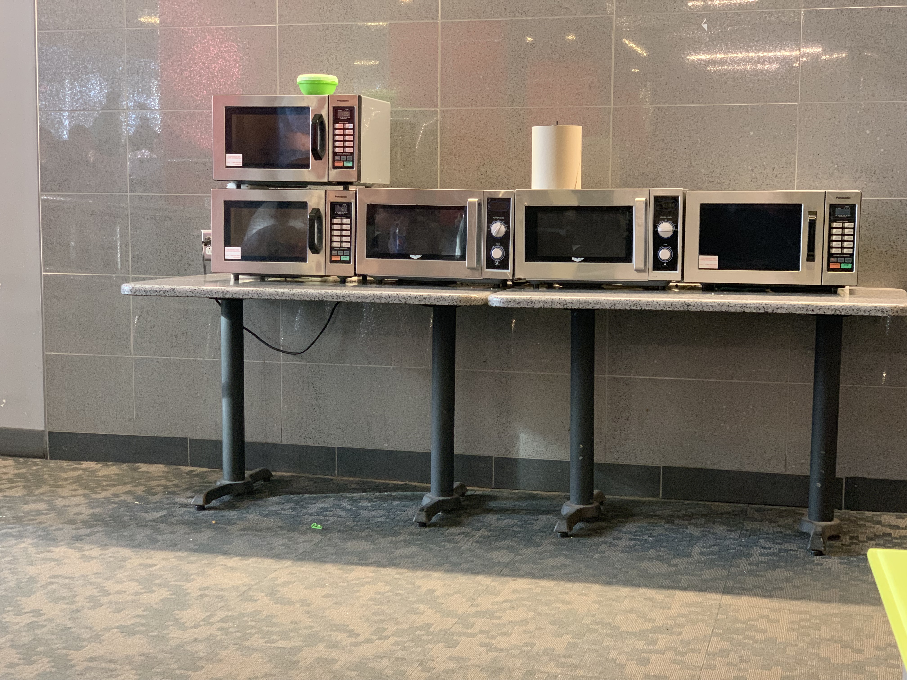
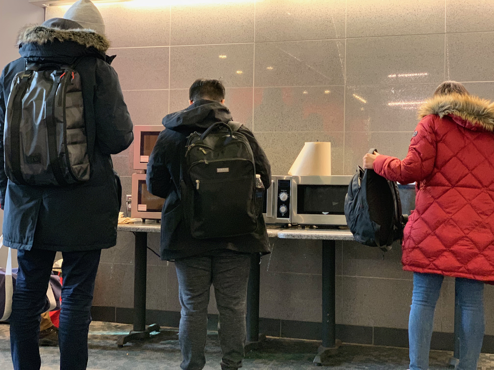

# HCI I3: Ethnography (CSC Improvements)

Nianmin Guo, Due 2019-01-29 Tuesday.

*Note: This assignment can also be viewed at [hci.htr.app](https://hci.htr.app/pages/I3-Ethnography)*

## Summary

Many students (me included) make their own food and bring them on campus for consumption. The need of these students has called heating devices made available at student centers. In CSC, there is a small microwave area next to the main seating area, and it is interesting to see how people interact with the microwave, the area itself, and other people doing the same activity. Although being a rather quick and trivial event, microwaving food on campus can be improved in terms of efficiency. 

## Observation Details

Observed Activity: Microwaving food in Curry Student Center

Observation Location: CSC Ground Floor, 15 ft from the group of microwaves

Observation Time: From 2019-01-28 Monday, 14:30, for 1 hour

Observation Subjects: Mainly student-looking individuals

### Environment / Artifact Interacted

Ground floor of Curry Student Center is where many student hang out, or work on a group project. There are also fast food and convenience store vendors close to the area. Thus, this area invites students to consume food. Some of the students would bring lunch boxes or other items that requires reheating, and there are some microwave ovens available for use in this area.

During the time of observation, the seating area is mostly full. As the lunch time passes, more seats becomes available. 

The microwave area consists of 5 microwaves (#1 from top left), with the first two stacked together. All microwaves have similar sizes, and all of them have doors opening to the left. Microwave #1, #2, and #5 are digital with (preset) time buttons [^1], while #3 and #4 has dials for adjusting heating time. There lies a roll of paper towel on #4 and a trash can right to the microwave tables. There is around less than a feet of space between the microwaves and the edges of the table.

For this observation period, it seems like that microwave #3 is not working (not responsive to door/dial actions), with no obvious indications.

{ width=75% }

{ width=75% }

## Observations

In the span of one hour, 28 people has used the microwave area, while 3 of them only used the paper towel on microwave #4 (since there is no napkin holders within 20 ft). However, the users came mostly in the first half than the second half. This might be caused by simply time of the day (second half starts at 3pm) or because of that people came to the area after their class were dismissed. 

For most of the cases, the student brought their own food for heating. One student heated a starbucks cup while another heated dumplings bought from the convenience store in CSC. For those who brought their own food [^3], a minority of them did not bring utensils, and they had to go to the fast food shop area to obtain them. Most heat their items under 3 minutes, while one user heated his food for 10 mins. The user waited on the side during the process. 

There are two types of microwaves on the table, and both of them requires one to two interactions on the main control panel in common use cases [^2]. No one used complicated functions, or changed the power level of any microwaves. However, in 7 cases the user would stop the process before the timer ends, and in all 7 cases the users did not reset the timer -- the timer is still displayed, and there are 3 cases where the next user observed the stopped (but showing) timer, and chose another microwave.

The unresponsiveness of microwave #3 was interesting to observe. 3 people attempted to use the out-of-order #3, and all of them only realized that something is wrong *after* they attempted to rotate the dial and no response is given by the machine. Interestingly, for the other functioning units, the display does not show anything when the unit is idle, making it difficult for users to identify a non-working unit. 

During the process, most people (23 out of 25) stayed near the area while the other two seem to have seatings near the area. Since #1 and #2 are stacked, there was one case where Person B wanted to use #2 while person A was blocking the area in front of #2. Person A saw Person B and moved to the side. There was another case of Person C on machine #2 waiting for Person D to take out his items from #1 first. 

The length of the tables can only support 4 microwaves (that might be why #1 and #2 are stacked). Meanwhile, the space between the front edge and the microwaves allowed users to prepare their items (pull them out from lunch bags, mix a little, etc.). 6 used paper towels while taking their items out, likely to avoid the high temperatures. 

## Interviews

Person A was interviewed around 14:48. He attempted to use #3 without knowing that it's broken, and I approached him. He was slightly annoyed by the broken one and said "it doesn't hurt to put a sign up or to fix it". Upon describing additional suggestions to the area, he said that he wanted more ("working") microwaves in the area. 

Person B was interviewed around 15:23. There was no issues during her process of heating her food. Upon asking if any improvements can be made, she said that "they should have more machines because during noontime here will get crowded and there is a line", and she did not provide any additional suggestions. 

There are other ways that the area can be more convenient to use -- a paper towel dispenser (instead of the lying roll), or a utensil basket. These suggestions can make many people's heating experience hassle free, but meanwhile they are asking for more direct ways to improve throughput. 

[^1]: E.g., A direct press of the "1" button might mean "Heat for 15 Seconds". 
[^2]: Press a button for the digital ones, rotate the dial and press the dial for the *pseudo-analog* ones.
[^3]: There was one brave soul who microwaved an aluminum can of beans, and fortunately I am still alive.