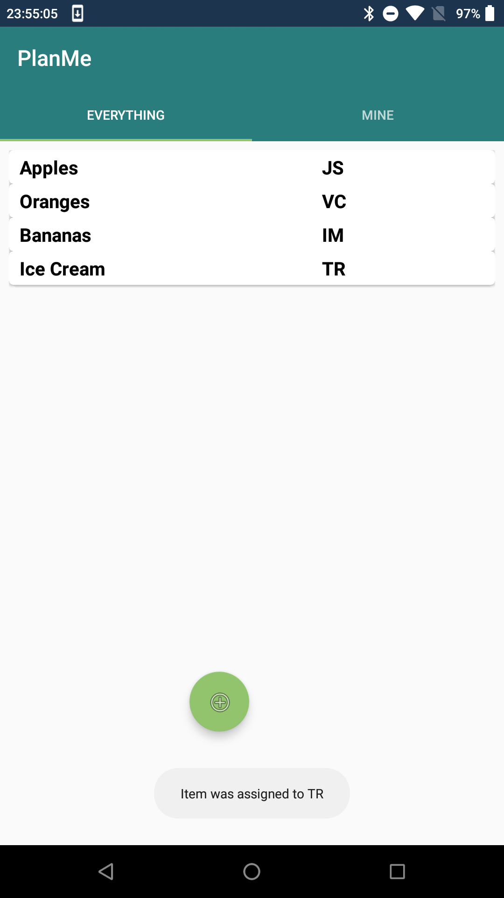
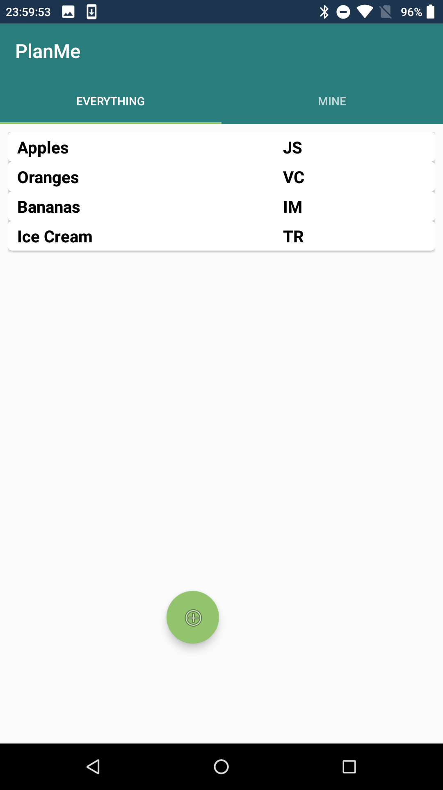
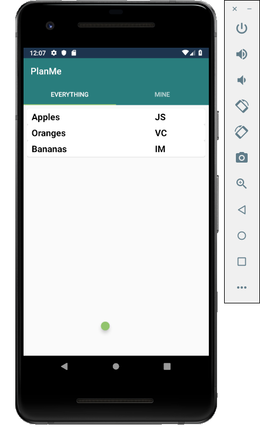

# HCI I6: Heuristic Evaluation 

Reviewing: [**Chaotic Party Planners (Link)**](https://sites.google.com/view/chaotic-party-planners/home)

*This page can also be viewed at [hci.htr.app](https://hci.htr.app/pages/I6-Heuristic_Evaluation)*

Nianmin Guo, Due 2019-03-19

## Usability Successes

### 1. Simplicity of Interface

The initial interface shows directly the list of items people are responsible for. There are no menus to clicks through and the Item to User Responsibility table, the most important element, occupies the main interface. 

Usability Heuristics:

- Simple and Natural Dialogue
- Minimize User Memory Load

Severity: Good

### 2. Instant Feedback

When performing task 1 and 2, the interface provided instant feedback, whether it is adding an item to list (refresh table), or the change of person responsible (refresh table and tooltip).

Usability Heuristics:

- Feedback

Severity: Good

### 3. Table Consistency

The *Everything* and *Mine* table share the same structure, thus allowing the user to share a mental model between the tables.

Usability Heuristics:

- Consistency
- Minimize User Memory Load

Severity: Good, but have drawbacks

## Usability Issues

### 4. Add Button Placement

The add button serves a clear purpose -- to add items. However, on my testing devices they appear to be in a weird position (since Material Design calls for a bottom right action button, and the button is off center as well). The icon failed to load in an emulator, causing slight confusion when running the app at the first time.

Usability Heuristics:

- Consistency
- Natural Dialogue (?)

Severity: Cosmetic (Placement), and Low (Icon Missing)

### 5. Input Sanitization

When adding items to the planning list, the program appears to perform no checks on input. I am able to enter duplicate items (Oranges), nothing, or a space. Technically they can be counted as valid items, but it will be rather confusing to users when they see duplicate or empty items.

Usability Heuristics:

- Prevent Errors (Did not)
- Good Error Messages (No)

Severity: Minor

### 6. Inability to Edit or Remove

It is impossible to make edits if an user has made a typo. Tapping an item assigns the item to the user, and no other actions are available. 

Usability Heuristics:

- Prevent Errors (?)

Severity: Major

### 7. Unclear Instructions on Assigning

I was expecting to see a panel/popup when tapping the list item. However, it assigned the item to me immediately. A panel showing detailed information with an *assign* button on the panel or next to the panel will work better. Combined with 6 it make the process impossible to undo, which might not be optimal. 

Usability Heuristics:

- Prevent Errors (did not)
- Simple and Natural Dialogue (might not be natural)
- Help and Documentation (none)

Severity: Major

## Debug Information 

Evaluation are conducted on 2 android devices. 

1. Android Emulator running API 28 (9.0), based on Pixel 2
2. Motorola x4 running API 27 (8.1), with 3rd party firmware